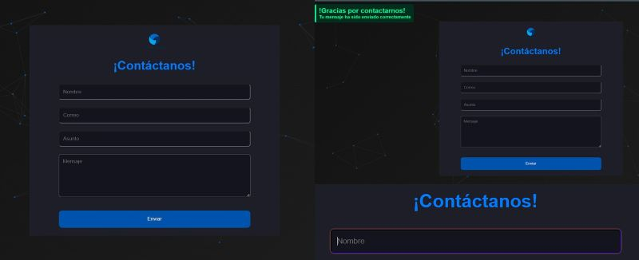

# Formulario de Contacto con Validación PHP y Envío de Correo

Este proyecto es un formulario de contacto desarrollado en PHP que incluye validaciones robustas para la información ingresada por el usuario y la funcionalidad de envío de correos electrónicos a través de PHPMailer.



## Características

* **Validación de Datos:**
    * Sanitización de los datos ingresados por el usuario para prevenir inyecciones de código malicioso.
    * Validación de campos obligatorios como nombre, correo electrónico y mensaje.
    * Validación de formato de correo electrónico.
* **Envío de Correos Electrónicos:**
    * Utilización de la librería PHPMailer para el envío de correos electrónicos.
    * Configuración sencilla de los parámetros del correo (destinatario, asunto, cuerpo, etc.).
* **Interfaz de Usuario Sencilla:**
    * Formulario HTML limpio y fácil de usar.
    * Mensajes de error claros para guiar al usuario en caso de datos inválidos.
* **Dependencias:**
    * PHPMailer: Librería para el envío de correos electrónicos desde PHP.

## Requisitos

* Servidor web con PHP 7.0 o superior.
* Acceso a un servidor SMTP (o configuración para usar la función `mail()` de PHP).
* Composer instalado para la gestión de dependencias.

## Instalación

1.  Clonar el repositorio:

    ```bash
    git clone https://github.com/argg9822/contact-form.git
    ```

2.  Navegar al directorio del proyecto:

    ```bash
    cd contact-form
    ```

3.  Instalar las dependencias con Composer:

    ```bash
    composer install
    ```

4.  Configura los parámetros del correo electrónico en el archivo de configuración. Se deberá suministrar los datos del servidor SMTP, asi como el correo electronico destinatario.

## Uso

1.  Abrir el formulario de contacto en el navegador web.
2.  Ingresar los datos solicitados en el formulario.
3.  Hacer clic en el botón de envío.
4.  Si los datos son válidos, se enviará un correo electrónico y se mostrará un mensaje de confirmación.
5.  En caso de datos inválidos, se mostrarán mensajes de error indicando los campos que deben corregirse.

## Estructura del Proyecto

* `index.php`: Archivo principal del formulario.
* `process-form.php.php`: Archivo que procesa los datos del formulario y envía el correo electrónico.
* `vendor/`: Directorio que contiene las dependencias instaladas con Composer.
* `composer.json`: Archivo de configuración de Composer.

## Contribución

¡Las contribuciones son bienvenidas! Si encuentras algún error o tienes alguna mejora que proponer, no dudes en crear un "pull request".

## Licencia

Este proyecto se distribuye bajo la licencia MIT. Consulta el archivo `LICENSE` para obtener más información.

## Contacto

Si tienes alguna pregunta o sugerencia, puedes contactarme a través de argg9822@gmail.com o creando un "issue" en este repositorio.
